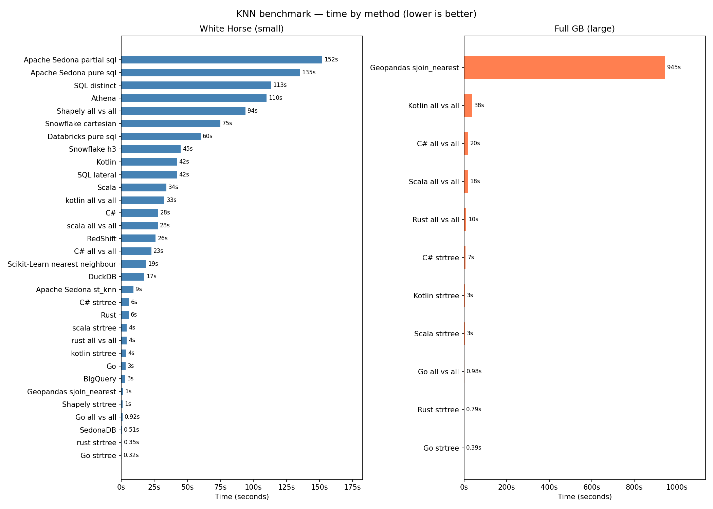

# spatial_knn
A compilation of solutions for the KNN (K-Nearest Neighbours) problem applied to spatial data.

See `results.png` for a speed comparison across methods.

## Local Setup

All Python scripts run inside a Docker container (`spatial_knn_python`) so that timeouts kill the entire process tree reliably, regardless of OS. PostgreSQL + PostGIS is also containerised.

**Requirements:** Docker, Docker Compose, and [uv](https://github.com/astral-sh/uv) (for running `main.py` itself on the host).

1. Copy the environment file and adjust credentials if needed:
   ```bash
   cp .env.example .env
   ```
2. Start the database and pre-build the benchmark images:
   ```bash
   docker compose up -d postgres
   docker compose build python sedona
   ```
3. Load data into the database (**one-time setup** — data is stored in a named Docker volume and persists across restarts). Use whichever source you have available:
   - **From Parquet files** (preprocessed, no raw data needed):
     ```bash
     uv run --env-file .env prepare_data.py --from-parquet
     ```
   - **From raw CSV/GPKG files** (transforms, writes Parquet + CSV, loads PostGIS):
     ```bash
     uv run --env-file .env prepare_data.py
     ```

### Raw data requirements

If running `--from-raw`, download the following Ordnance Survey open datasets and place them under `data/raw/`:

| File | Source | Description |
|---|---|---|
| `data/raw/osopenuprn_<date>.csv` | [OS Open UPRN](https://osdatahub.os.uk/downloads/open/OpenUPRN) | Unique Property Reference Numbers with coordinates (full GB) |
| `data/raw/codepo_gb.gpkg` | [Code-Point Open](https://osdatahub.os.uk/downloads/open/CodePointOpen) | Postcode centroids (GeoPackage format) |
| `data/raw/bdline_gb.gpkg` | [Boundary-Line](https://osdatahub.os.uk/downloads/open/BoundaryLine) | Administrative boundaries incl. district polygons (GeoPackage format) |

All three are free to download from the [OS Data Hub](https://osdatahub.os.uk) (account required).

## Running the benchmarks

`main.py` is the entry point. It imports all runner functions from `runners.py` and orchestrates the benchmark scenarios defined in `SCENARIOS`.

```bash
# Run all scenarios
uv run --env-file .env main.py

# Run a single scenario
uv run --env-file .env main.py --scenario "White Horse (small)"
uv run --env-file .env main.py --scenario "Full GB (large)"
```

Each Python-based benchmark script runs inside the `spatial_knn_python` Docker container via `docker run --rm`. On timeout, `docker kill` is called — this guarantees immediate termination of the container and any in-flight work (including long-running GeoPandas or SQL operations).

Two scenarios are defined:

| Dataset | UPRN table | Codepoint table | Timeout | Reference |
|---|---|---|---|---|
| White Horse (small) | `os.open_uprn_white_horse` | `os.code_point_open_white_horse` | none | SQL distinct |
| Full GB (large) | `os.os_open_uprn` | `os.codepoint_polygons` | 30 min | Rust (strtree) |

For the large dataset, Rust runs first to generate the reference output (SQL distinct would take >3 hours). All other methods are limited to 30 minutes; PostgreSQL queries also receive a matching `statement_timeout` so the server-side query is cancelled before the container timeout fires.

## Code structure

| File | Purpose |
|---|---|
| `main.py` | CLI entry point — parses args, runs scenarios, generates plot and README table |
| `runners.py` | All runner functions (`run_script`, `run_kotlin`, `run_rust`, etc.), scenario definitions, `make_plot`, `update_readme` |
| `python.Dockerfile` | Image used by all Python benchmark scripts |
| `sedona.Dockerfile` | Image for Apache Sedona (Spark) scripts |
| `prepare_data.py` | One-time data loading into PostGIS |
| `docker-compose.yml` | postgres, python, sedona, kotlin, scala services on a shared `spatial_knn` network |

## When to use what

- **SedonaDB** — data fits in memory, you want SQL semantics with Sedona's spatial functions without a server; Very fast, simple to use.
- **Shapely / Geopandas** — data fits in memory, Python-only stack, geometries beyond points.
- **DuckDB** — data fits in memory, you want SQL semantics without a server, or you are already working with Parquet files.
- **Scikit-Learn** — data fits in memory, points only. Could be faster than Shapely when finding only one neighbour per point, but cannot break ties by postcode (or any secondary sort key), so results may differ from the other implementations in those edge cases.
- **SQL (PostgreSQL + PostGIS)** — data does not fit in memory, or you need to join against other tables and write complex queries.
- **C# (.NET / NetTopologySuite)** — already in the .NET ecosystem; API mirrors the JVM JTS library. Similar speed to the JVM solutions, easier to run as it requires fewer settings.
- **Scala / Kotlin (JVM)** — KNN is one part of a larger JVM application; slower than Go/Rust but with a larger library ecosystem.
- **Go / Rust** — maximum single-machine speed; choose when the compiled language fits your stack. Rust edges out Go slightly.
- **Apache Sedona / PySpark** — data is too large for a single machine and must be distributed across a cluster.
- **Databricks, BigQuery / Redshift / Snowflake / Athena** *(paid managed services)* — data lives in a cloud warehouse and you want to avoid moving it. BigQuery is the fastest of the four here; Athena is slowest and roughly on par with local Postgres for data that fits Postgres.


<!-- RESULTS_START -->
## Results

| test                           | time                   |
|:-------------------------------|:-----------------------|
| Go strtree                     | 0 days 00:00:00.321024 |
| rust strtree                   | 0 days 00:00:00.346612 |
| SedonaDB                       | 0 days 00:00:00.750684 |
| Go all vs all                  | 0 days 00:00:00.916740 |
| Shapely strtree                | 0 days 00:00:01.319851 |
| Geopandas sjoin_nearest        | 0 days 00:00:01.791905 |
| BigQuery                       | 0 days 00:00:03        |
| kotlin strtree                 | 0 days 00:00:03.627000 |
| rust all vs all                | 0 days 00:00:04.044441 |
| scala strtree                  | 0 days 00:00:04.142000 |
| C# strtree                     | 0 days 00:00:05.894800 |
| Apache Sedona st_knn           | 0 days 00:00:09.269729 |
| DuckDB                         | 0 days 00:00:17.465032 |
| C# all vs all                  | 0 days 00:00:22.904955 |
| Scikit-Learn nearest neighbour | 0 days 00:00:25.355890 |
| RedShift                       | 0 days 00:00:26        |
| scala all vs all               | 0 days 00:00:27.585000 |
| kotlin all vs all              | 0 days 00:00:32.706000 |
| Snowflake h3                   | 0 days 00:00:45        |
| Databricks pure sql            | 60s                    |
| SQL lateral                    | 63s                    |
| Snowflake cartesian            | 75s                    |
| Athena                         | 110s                   |
| Shapely all vs all             | 127s                   |
| SQL distinct                   | 130s                   |
| Apache Sedona partial sql      | 152s                   |
| Apache Sedona pure sql         | 158s                   |
| BigQuery (Slot time consumed)  | 310s                   |
<!-- RESULTS_END -->


