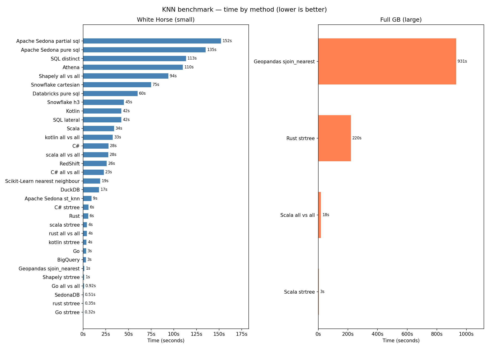

# spatial_knn
A compilation of solutions for the KNN (K-Nearest Neighbours) problem applied to spatial data.

See `results.png` for a speed comparison across methods.

## Local Setup

All Python scripts run inside a Docker container (`spatial_knn_python`) so that timeouts kill the entire process tree reliably, regardless of OS. PostgreSQL + PostGIS is also containerised.

**Requirements:** Docker, Docker Compose, and [uv](https://github.com/astral-sh/uv) (for running `main.py` itself on the host).

1. Copy the environment file and adjust credentials if needed:
   ```bash
   cp .env.example .env
   ```
2. Start the database and pre-build the benchmark images:
   ```bash
   docker compose up -d postgres
   docker compose build python sedona
   ```
3. Load data into the database (**one-time setup** — data is stored in a named Docker volume and persists across restarts). Use whichever source you have available:
   - **From Parquet files** (preprocessed, no raw data needed):
     ```bash
     uv run --env-file .env prepare_data.py --from-parquet
     ```
   - **From raw CSV/GPKG files** (transforms, writes Parquet + CSV, loads PostGIS):
     ```bash
     uv run --env-file .env prepare_data.py
     ```

### Raw data requirements

If running `--from-raw`, download the following Ordnance Survey open datasets and place them under `data/raw/`:

| File | Source | Description |
|---|---|---|
| `data/raw/osopenuprn_<date>.csv` | [OS Open UPRN](https://osdatahub.os.uk/downloads/open/OpenUPRN) | Unique Property Reference Numbers with coordinates (full GB) |
| `data/raw/codepo_gb.gpkg` | [Code-Point Open](https://osdatahub.os.uk/downloads/open/CodePointOpen) | Postcode centroids (GeoPackage format) |
| `data/raw/bdline_gb.gpkg` | [Boundary-Line](https://osdatahub.os.uk/downloads/open/BoundaryLine) | Administrative boundaries incl. district polygons (GeoPackage format) |

All three are free to download from the [OS Data Hub](https://osdatahub.os.uk) (account required).

## Running the benchmarks

`main.py` is the entry point. It imports all runner functions from `runners.py` and orchestrates the benchmark scenarios defined in `SCENARIOS`.

```bash
# Run all scenarios
uv run --env-file .env main.py

# Run a single scenario
uv run --env-file .env main.py --scenario "White Horse (0m buffer)"
uv run --env-file .env main.py --scenario "White Horse (1km buffer)"
uv run --env-file .env main.py --scenario "White Horse (10km buffer)"
uv run --env-file .env main.py --scenario "White Horse (100km buffer)"

# Run specific solutions only (one or more)
uv run --env-file .env main.py --scenario "White Horse (100km buffer)" --solution shapely_strtree
uv run --env-file .env main.py --scenario "White Horse (100km buffer)" --solution rust_tree go_tree kotlin_tree

# Skip recomputing the reference CSV if it already exists on disk
uv run --env-file .env main.py --scenario "White Horse (100km buffer)" --skip-reference

# Regenerate plot and README from existing baselines.csv without re-running benchmarks
uv run --env-file .env main.py --results-only
```

Available solution names: `sql_distinct`, `sql_lateral`, `geopandas`, `shapely_all_vs_all`, `shapely_strtree`, `sklearn`, `sedona_partial`, `sedona_pure`, `sedona_knn`, `kotlin_brute`, `kotlin_tree`, `scala_brute`, `scala_tree`, `rust_brute`, `rust_tree`, `csharp_brute`, `csharp_tree`, `go_brute`, `go_tree`, `duckdb`, `sedonadb`.

Each Python-based benchmark script runs inside the `spatial_knn_python` Docker container via `docker run --rm`. On timeout, `docker kill` is called — this guarantees immediate termination of the container and any in-flight work (including long-running GeoPandas or SQL operations).

Three scenarios are defined, all based on buffers around the Vale of White Horse district polygon:

| Dataset | UPRN table | Codepoint table | Timeout | Reference |
|---|---|---|---|---|
| White Horse (0m buffer) | `os.open_uprn_white_horse` | `os.code_point_open_white_horse` | 1 hr | Rust (strtree) |
| White Horse (1km buffer) | `os.uprn_wh_1km` | `os.cp_wh_1km` | 1 hr | Rust (strtree) |
| White Horse (10km buffer) | `os.uprn_wh_10km` | `os.cp_wh_10km` | 1 hr | Rust (strtree) |
| White Horse (100km buffer) | `os.uprn_wh_100km` | `os.cp_wh_100km` | 1 hr | Rust (strtree) |

For each scenario Rust runs first to generate the reference output, then SQL distinct runs, then all other methods. Each per-scenario reference is saved to a unique CSV (`rust/rust_tree_wh_0.csv`, `rust/rust_tree_wh_1km.csv`, `rust/rust_tree_wh_10km.csv`) so `--skip-reference` works correctly across scenarios.

## Code structure

| File | Purpose |
|---|---|
| `main.py` | CLI entry point — parses args, runs scenarios, generates plot and README table |
| `runners.py` | All runner functions (`run_script`, `run_kotlin`, `run_rust`, etc.), scenario definitions, `make_plot`, `update_readme` |
| `python.Dockerfile` | Image used by all Python benchmark scripts |
| `sedona.Dockerfile` | Image for Apache Sedona (Spark) scripts |
| `prepare_data.py` | One-time data loading into PostGIS |
| `docker-compose.yml` | postgres, python, sedona, kotlin, scala services on a shared `spatial_knn` network |

## When to use what

- **SedonaDB** — data fits in memory, you want SQL semantics with Sedona's spatial functions without a server; Very fast, simple to use.
- **Shapely / Geopandas** — data fits in memory, Python-only stack, geometries beyond points.
- **DuckDB** — data fits in memory, you want SQL semantics without a server, or you are already working with Parquet files.
- **Scikit-Learn** — data fits in memory, points only. Could be faster than Shapely when finding only one neighbour per point, but cannot break ties by postcode (or any secondary sort key), so results may differ from the other implementations in those edge cases.
- **SQL (PostgreSQL + PostGIS)** — data does not fit in memory, or you need to join against other tables and write complex queries.
- **C# (.NET / NetTopologySuite)** — already in the .NET ecosystem; API mirrors the JVM JTS library. Similar speed to the JVM solutions, easier to run as it requires fewer settings.
- **Scala / Kotlin (JVM)** — KNN is one part of a larger JVM application; slower than Go/Rust but with a larger library ecosystem.
- **Go / Rust** — maximum single-machine speed; choose when the compiled language fits your stack. Rust edges out Go slightly.
- **Apache Sedona / PySpark** — data is too large for a single machine and must be distributed across a cluster.
- **Databricks, BigQuery / Redshift / Snowflake / Athena** *(paid managed services)* — data lives in a cloud warehouse and you want to avoid moving it. BigQuery is the fastest of the four here; Athena is slowest and roughly on par with local Postgres for data that fits Postgres.


<!-- RESULTS_START -->
## Results — White Horse (0m buffer)

| test                           | elapsed_s   |
|:-------------------------------|:------------|
| Rust strtree                   | 0.11s       |
| SQL distinct                   | 184s        |
| SQL lateral                    | 156s        |
| Geopandas sjoin_nearest        | 0.69s       |
| Shapely all vs all             | 103s        |
| Shapely strtree                | 2s          |
| Scikit-Learn nearest neighbour | 25s         |
| Apache Sedona partial sql      | 226s        |
| Apache Sedona pure sql         | 209s        |
| Apache Sedona st_knn           | 49s         |
| Kotlin all vs all              | 44s         |
| Kotlin strtree                 | 5s          |
| Scala all vs all               | 30s         |
| Scala strtree                  | 5s          |
| Rust all vs all                | 8s          |
| C# all vs all                  | 25s         |
| C# strtree                     | 7s          |
| Go all vs all                  | 1s          |
| Go strtree                     | 0.52s       |
| DuckDB                         | 21s         |
| SedonaDB                       | 0.89s       |

## Results — White Horse (1km buffer)

| test                           | elapsed_s   |
|:-------------------------------|:------------|
| Rust strtree                   | 0.22s       |
| SQL distinct                   | 247s        |
| SQL lateral                    | 254s        |
| Geopandas sjoin_nearest        | 1.00s       |
| Shapely all vs all             | 152s        |
| Shapely strtree                | 3s          |
| Scikit-Learn nearest neighbour | 32s         |
| Apache Sedona partial sql      | 257s        |
| Apache Sedona pure sql         | 243s        |
| Apache Sedona st_knn           | 50s         |
| Kotlin all vs all              | 74s         |
| Kotlin strtree                 | 6s          |
| Scala all vs all               | 47s         |
| Scala strtree                  | 7s          |
| Rust all vs all                | 13s         |
| C# all vs all                  | 38s         |
| C# strtree                     | 9s          |
| Go all vs all                  | 2s          |
| Go strtree                     | 0.63s       |
| DuckDB                         | 31s         |
| SedonaDB                       | 1s          |
<!-- RESULTS_END -->


